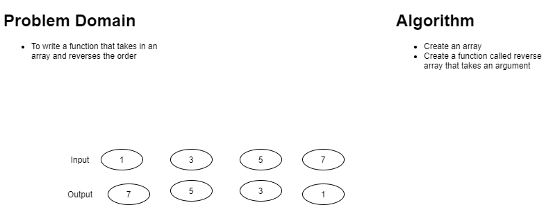

# Reverse an Array
<!-- Short summary or background information -->

## Challenge
<!-- Description of the challenge -->

## Approach & Efficiency
<!-- What approach did you take? Why? What is the Big O space/time for this approach? -->

## Solution

<!-- Embedded whiteboard image -->